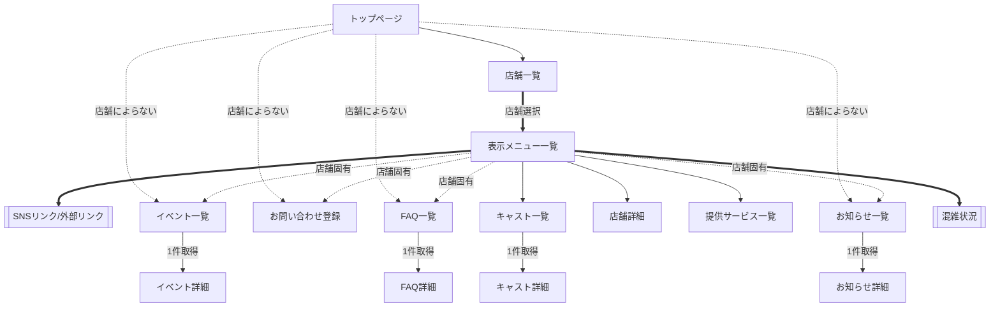
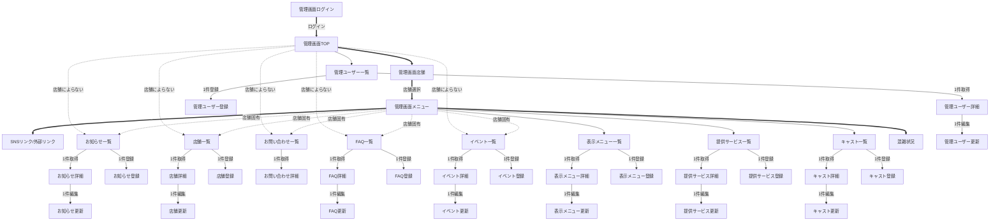

# 成果物：2.猫カフェシステム(画面遷移図)
====

## Screen Transition Diagram
+ Screen(画面)
+ Transition(遷移)
+ Diagram(図)

## 画面遷移図

下記のフローチャートは [Mermaid/flowchart](https://mermaid-js.github.io/mermaid/#/flowchart) を使用しています。  

### 図形種別

| 項番 | 種別 | 記法 | 
| :--- | :--- | :--- | 
| 1 | 機能名 | A node in a subroutine shape | 
| 2 | 画面名 | A node with text | 
| 3 | 分岐付操作 | Dotted link with text | 
| 4 | 機能間操作 | Thick link with text | 
| 5 | 機能内操作 | A link with arrow head and text | 

### 1.ポータルサイト



<details>
<summary>markdown</summary>

```markdown
TOP: トップ
C: お知らせ
  C1: お知らせ一覧
  C2: お知らせ詳細
D: 店舗
  D1: 店舗一覧
  D2: 店舗詳細
E: お問い合わせ
  E3: お問い合わせ登録
F: FAQ
  F1: FAQ一覧
  F2: FAQ詳細
G: 表示メニュー
  G1: 表示メニュー一覧
I: 提供サービス
  I1: 提供サービス一覧
J: キャスト
  J1: キャスト一覧
  J2: キャスト詳細
M: イベント
  M1: イベント一覧
  M2: イベント詳細
N: 混雑状況
O: SNSリンク/外部リンク
```

</details>

### 2.管理システム



<details>
<summary>markdown</summary>

```markdown
ADMIN_TOP: 管理画面TOP
ADMIN_LOGIN: 管理画面ログイン
ADMIN_TENPO: 管理画面店舗
ADMIN_MENU: 管理画面メニュー
C: お知らせ
  C1: お知らせ一覧
  C2: お知らせ詳細
  C3: お知らせ登録
  C4: お知らせ更新
D: 店舗
  D1: 店舗一覧
  D2: 店舗詳細
  D3: 店舗登録
  D4: 店舗更新
E: お問い合わせ
  E1: お問い合わせ一覧
  E2: お問い合わせ詳細
F: FAQ
  F1: FAQ一覧
  F2: FAQ詳細
  F3: FAQ登録
  F4: FAQ更新
G: 表示メニュー
  G1: 表示メニュー一覧
  G2: 表示メニュー詳細
  G3: 表示メニュー登録
  G4: 表示メニュー更新
I: 提供サービス
  I1: 提供サービス一覧
  I2: 提供サービス詳細
  I3: 提供サービス登録
  I4: 提供サービス更新
J: キャスト
  J1: キャスト一覧
  J2: キャスト詳細
  J3: キャスト登録
  J4: キャスト更新
M: イベント
  M1: イベント一覧
  M2: イベント詳細
  M3: イベント登録
  M4: イベント更新
N: 混雑状況
O: SNSリンク/外部リンク
Q: 管理画面用ユーザー
  Q1: ユーザー一覧
  Q2: ユーザー詳細
  Q3: ユーザー登録
  Q4: ユーザー更新
```

</details>
